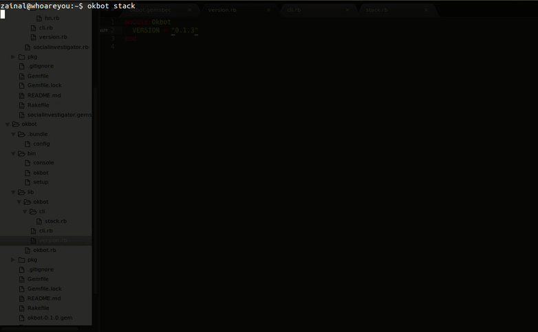

# Okbot

[](https://badge.fury.io/rb/okbot)

Welcome to your new gem! In this directory, you'll find the files you need to be able to package up your Ruby library into a gem. Put your Ruby code in the file `lib/okbot`. To experiment with that code, run `bin/console` for an interactive prompt.

## Installation

Add this line to your application's Gemfile:

```ruby
gem 'okbot'
```

And then execute:

    $ bundle

Or install it yourself as:

    $ gem install okbot

## Usage
For Blitz bandung

For StackOverFlow


    $ okbot
    Commands:
      okbot blitz           # Get schedule theater on blitz bandung
      okbot help [COMMAND]  # Describe available commands or one specific command
      okbot spin_it         # FOR LOADING
      okbot stack COMMANDS  # Get Stack overflow question
    
    $ okbot blitz
    $ okbot stack title


## Development

After checking out the repo, run `bin/setup` to install dependencies. You can also run `bin/console` for an interactive prompt that will allow you to experiment.

To install this gem onto your local machine, run `bundle exec rake install`. To release a new version, update the version number in `version.rb`, and then run `bundle exec rake release`, which will create a git tag for the version, push git commits and tags, and push the `.gem` file to [rubygems.org](https://rubygems.org).

## Contributing

Bug reports and pull requests are welcome on GitHub at https://github.com/[USERNAME]/okbot.

